---
## Front matter
title: "Отчёт по лабораторной работе № 3"
subtitle: "Система контроля версий Git"
author: "Мокочунина Влада Сергеевна"

## Generic otions
lang: ru-RU
toc-title: "Содержание"

## Bibliography
bibliography: bib/cite.bib
csl: pandoc/csl/gost-r-7-0-5-2008-numeric.csl

## Pdf output format
toc: true # Table of contents
toc-depth: 2
lof: true # List of figures
lot: true # List of tables
fontsize: 12pt
linestretch: 1.5
papersize: a4
documentclass: scrreprt
## I18n polyglossia
polyglossia-lang:
  name: russian
  options:
	- spelling=modern
	- babelshorthands=true
polyglossia-otherlangs:
  name: english
## I18n babel
babel-lang: russian
babel-otherlangs: english
## Fonts
mainfont: PT Serif
romanfont: PT Serif
sansfont: PT Sans
monofont: PT Mono
mainfontoptions: Ligatures=TeX
romanfontoptions: Ligatures=TeX
sansfontoptions: Ligatures=TeX,Scale=MatchLowercase
monofontoptions: Scale=MatchLowercase,Scale=0.9
## Biblatex
biblatex: true
biblio-style: "gost-numeric"
biblatexoptions:
  - parentracker=true
  - backend=biber
  - hyperref=auto
  - language=auto
  - autolang=other*
  - citestyle=gost-numeric
## Pandoc-crossref LaTeX customization
figureTitle: "Рис."
tableTitle: "Таблица"
listingTitle: "Листинг"
lofTitle: "Список иллюстраций"
lolTitle: "Листинги"
## Misc options
indent: true
header-includes:
  - \usepackage{indentfirst}
  - \usepackage{float} # keep figures where there are in the text
  - \floatplacement{figure}{H} # keep figures where there are in the text
---

# Цель работы

Целью работы является изучение идеологии и применения средств
контроля версий. Приобретение практических навыков по работе с системой
git.

# Задание

Создать аккаунт на Github, сделать конфигурацию git с помощью
консоли, создать SSH ключ, рабочее пространство и репозиторий курса,
настроив его.

# Теоретическое введение

Системы контроля версий служат помощью для работы нескольких
человек над одним проектом. Дерево проекта хранится в локальном или
удалённом репозитории (к нему имеется доступ у всех участников работы).
Внося изменения в содержание работы система контроля помогает
фиксировать их, совместить изменения всех участников. В классических
системах контроля версий используется централизованная модель, имеющая
единый репозиторий для хранения файлов. Выполнение большинства
функций по управлению версиями осуществляется специальным сервером.
Пользователь перед началом работы посредством определённых команд
может получить нужную ему версию файлов. После внесения изменений,
новая версия размещается в хранилище (предыдущие версии не удаляются из
центрального хранилища). Дельта-компрессия — сохранение только
изменения между последовательными версиями. Она позволяет уменьшить
объём хранимых данных. При помощи системы контроля версий можно
отслеживать и разрешать конфликты. Изменения можно объединять,
отменять, вручную выбирать нужную версию, блокировать файлы, что дает
привилегированный доступ только одному пользователю, работающему с
файлом. Системы контроля версий обеспечивают дополнительные
функциональные возможности: поддерживают работу с несколькими
версиями одного файла, сохраняя общую историю изменений. Имеется
доступ информация о том, кто из участников, когда и какие изменения
вносил. В отличие от классических, в распределённых системах контроля
версий центральный репозиторий не является обязательным. Система
контроля версий Git - набор программ командной строки. Доступ к ним
можно получить из терминала при помощи ввода команды git с различными
опциями.
Основные команды git: git init создание основного дерева репозитория,
git pull получение обновлений текущего дерева из центрального репозитория,
git push отправка всех произведённых изменений локального дерева в
центральный репозиторий, git status просмотр списка изменённых файлов в
текущей директории, git diff просмотр текущих изменения, git add .
добавление всех изменённых или созданных файлов или каталогов, git add
имена_файлов добавить конкретные изменённые файлы, git rm удалить файл
и/или каталог из индекса, git commit -am сохранить все добавленные
изменения и все изменённые файлы, git checkout -b создание новой ветки,
базирующейся на текущей, git checkout имя_ветки переключение на
некоторую ветку (при переключении на ветку, которой ещё нет в локальном
репозитории, git push origin имя_ветки отправка изменений конкретной ветки
в центральный репозиторий, git merge --no-ff имя_ветки слияние ветки с
4текущим деревом, git branch -d имя_ветки удаление локальной уже слитой с
основным деревом ветки ,git branch -D имя_ветки принудительное удаление
локальной ветки, git push origin :имя_ветки удаление ветки с центрального
репозитория.

# Выполнение лабораторной работы

1. Я создала учётную запись на сайте https://github.com/ и заполнила
основные данные (рис. [-@fig:001]).

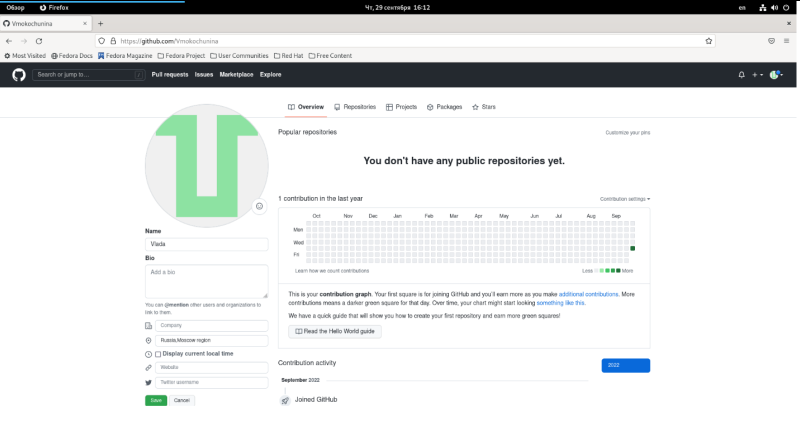{ #fig:001 width=70% }

2. Я сделала предварительную конфигурацию git.

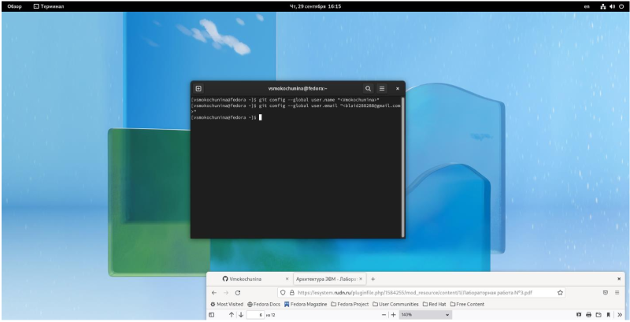{ #fig:002 width=70% }

3. Я настроила utf-8 в выводе сообщений git.

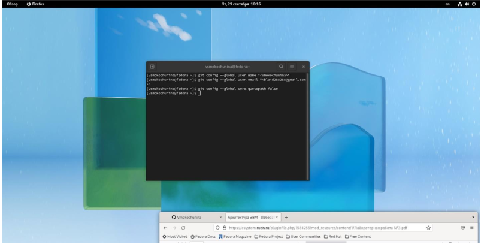{ #fig:003 width=70% }

4. Я задала имя начальной ветки, параметр autocrlf и параметр safecrlf.

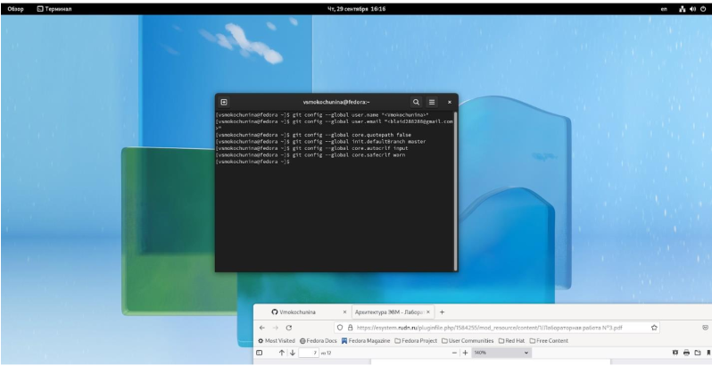{ #fig:004 width=70% }

5. Я сгенерировала пару ключей (приватный и открытый).

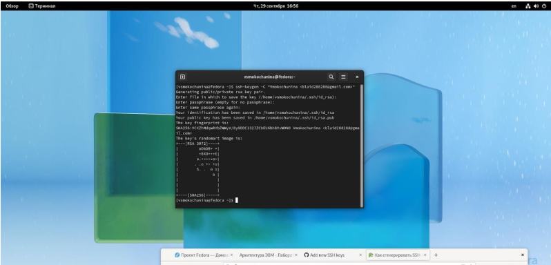{ #fig:005 width=70% }

6. Я загрузила сгенерённый открытый ключ.

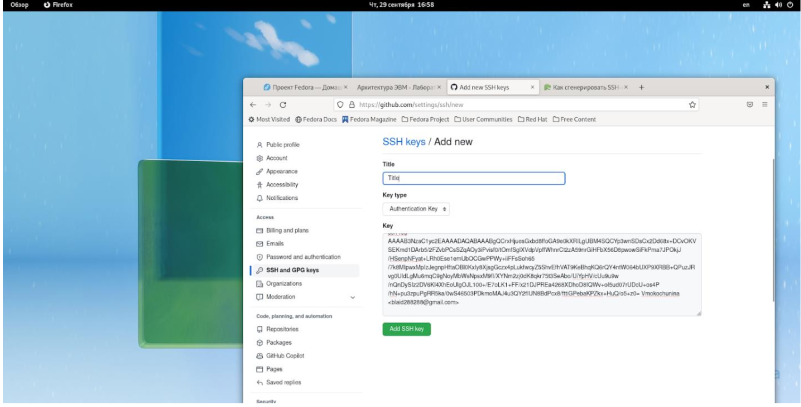{ #fig:006 width=70% }

7. Я создала каталог для предмета «Архитектура компьютера».

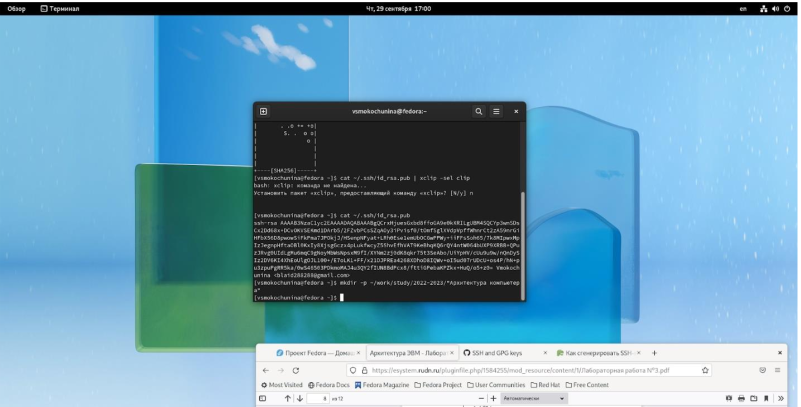{ #fig:007 width=70% }

8. Я перешла на станицу репозитория с шаблоном курса и выбрала Use this template.

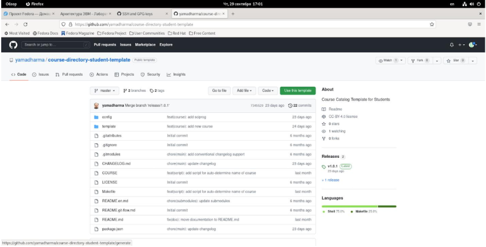{ #fig:008 width=70% }

9. В открывшемся окне я задала имя репозитория и создала его.

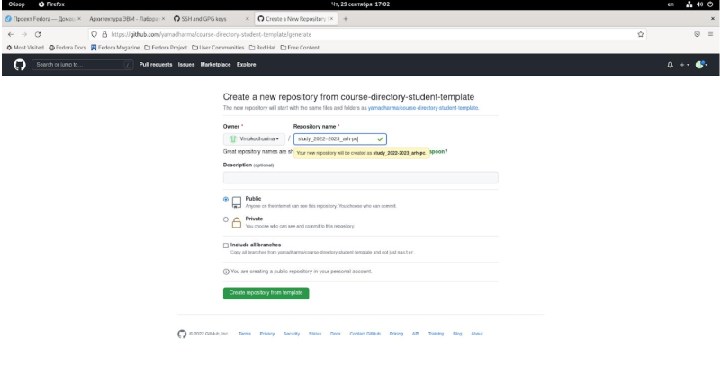{ #fig:009 width=70% }

10. С помощью терминала я перешла в каталог курса.

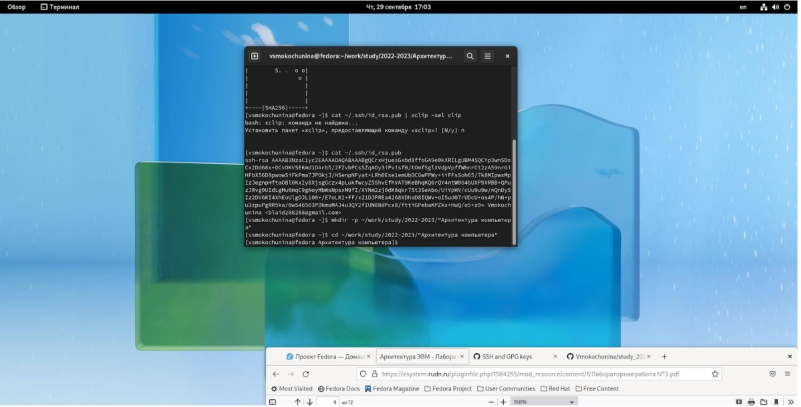{ #fig:010 width=70% }

11. Я клонировала созданный репозиторий.

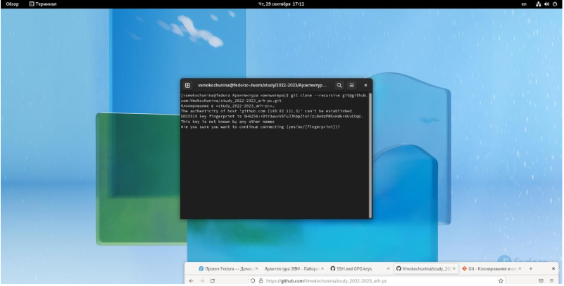{ #fig:011 width=70% }

12. Я перешла в каталог курса и удалила лишние файлы.

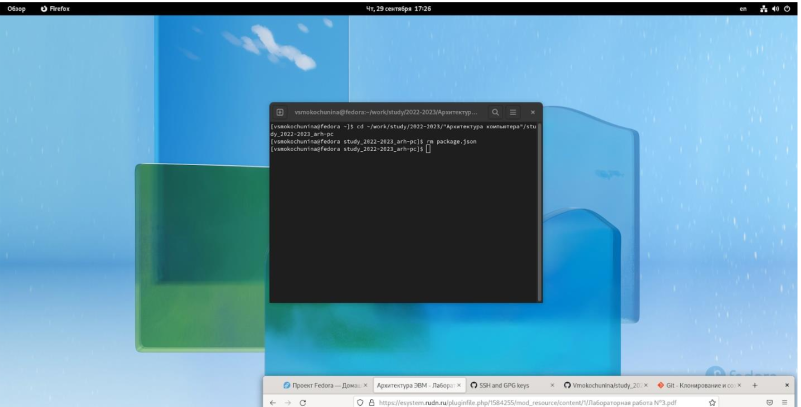{ #fig:012 width=70% }

13. Я создала необходимые каталоги.

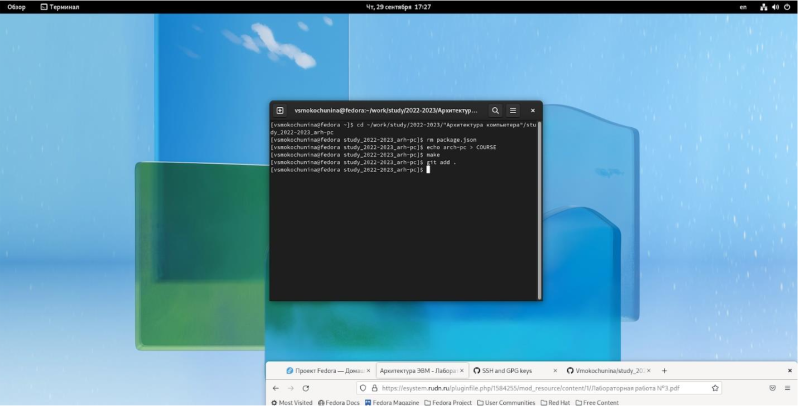{ #fig:013 width=70% }

14. Я отправила файлы на сервер.

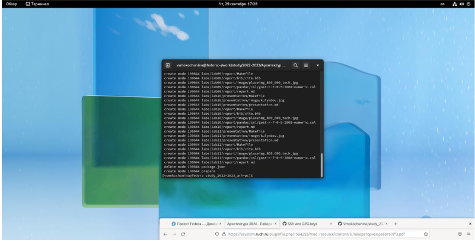{ #fig:014 width=70% }

15. Я проверила правильность создания иерархии рабочего
пространства.

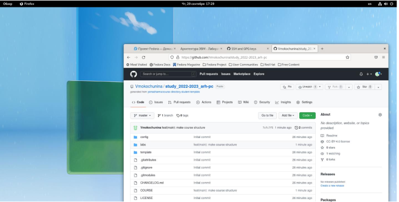{ #fig:015 width=70% }

#Самостоятельная работа

1. Я скопировала отчеты по выполнению предыдущих лабораторных работ в соответствующие каталоги созданного рабочего пространства.

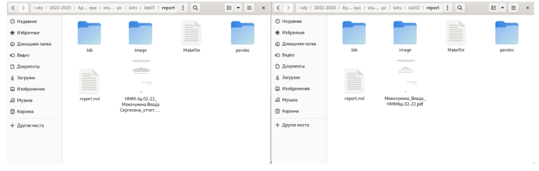{ #fig:016 width=70% }

2. Я загрузила файлы на github.

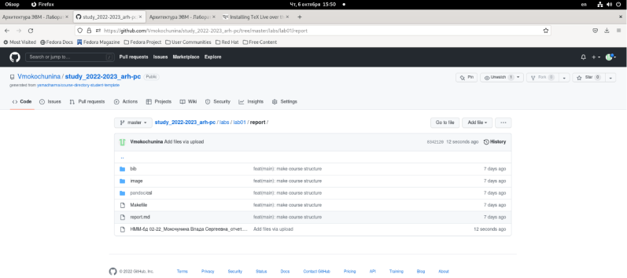{ #fig:017 width=70% }

# Выводы

Я изучила идеологию и применение средств контроля версий, приобрела
практические навыки по работе с системой git.

::: {#refs}
:::
