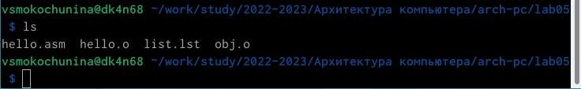
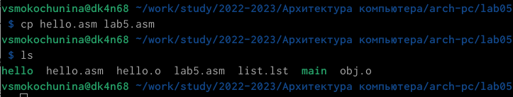

---
## Front matter
title: "Отчет по лабораторной работе №5"
author: "Мокочунина Влада Сергеевна"

## Generic otions
lang: ru-RU
toc-title: "Содержание"

## Bibliography
bibliography: bib/cite.bib
csl: pandoc/csl/gost-r-7-0-5-2008-numeric.csl

## Pdf output format
toc: true # Table of contents
toc-depth: 2
lof: true # List of figures
lot: true # List of tables
fontsize: 12pt
linestretch: 1.5
papersize: a4
documentclass: scrreprt
## I18n polyglossia
polyglossia-lang:
  name: russian
  options:
	- spelling=modern
	- babelshorthands=true
polyglossia-otherlangs:
  name: english
## I18n babel
babel-lang: russian
babel-otherlangs: english
## Fonts
mainfont: PT Serif
romanfont: PT Serif
sansfont: PT Sans
monofont: PT Mono
mainfontoptions: Ligatures=TeX
romanfontoptions: Ligatures=TeX
sansfontoptions: Ligatures=TeX,Scale=MatchLowercase
monofontoptions: Scale=MatchLowercase,Scale=0.9
## Biblatex
biblatex: true
biblio-style: "gost-numeric"
biblatexoptions:
  - parentracker=true
  - backend=biber
  - hyperref=auto
  - language=auto
  - autolang=other*
  - citestyle=gost-numeric
## Pandoc-crossref LaTeX customization
figureTitle: "Рис."
listingTitle: "Листинг"
lofTitle: "Список иллюстраций"
lotTitle: "Список таблиц"
lolTitle: "Листинги"
## Misc options
indent: true
header-includes:
  - \usepackage{indentfirst}
  - \usepackage{float} # keep figures where there are in the text
  - \floatplacement{figure}{H} # keep figures where there are in the text
---

# Цель работы

Освоение процедуры компиляции и сборки программ, написанных на ассемблере NASM.

# Задание

Освоить процедуры компиляции, сборки программ, написанных на NASM.

# Выполнение лабораторной работы

1. Я создала каталог для работы с программами на языке ассемблера NASM и перешла в каталог. (рис. [-@fig:001])

{ #fig:001 width=70% }

2. Я создала текстовый файл.

{ #fig:002 width=70% }

3. С помощью текстового редактора я открыла файл.

{ #fig:003 width=70% }

4. Я ввела в файл текст.

{ #fig:004 width=70% }

5. Я сделала компиляцию текста и проверила, что файл был создан.

{ #fig:005 width=70% }

6. Я выполнила команду, чтобы скомпилировать исходный файл hello.asm в obj.o.

{ #fig:006 width=70% }

{ #fig:007 width=70% }

7. Я выполнила команду, чтобы передать объектный файл на обработку компоновщику.

{ #fig:008 width=70% }

8. Я выполнила следующую команду.

{ #fig:009 width=70% }

9. Я запустила на выполнение созданный исполняемый файл.

{ #fig:010 width=70% }

# Самостоятельная работа

1. Я скопировала и переименовала файл.

{ #fig:011 width=70% }

2. Я ввела в файл свои имя и фамилию.

{ #fig:012 width=70% }

3. Я оттранслировала текст и выполнила комоновку файла.

{ #fig:013 width=70% }

4. Я запустила файл.

{ #fig:014 width=70% }

5. Я скопировала файлы в нужный каталог.

{ #fig:015 width=70% }

6. Отправила файлы на сервер.

{ #fig:016 width=70% }

# Выводы

Я освоила процедуры компиляции, сборки программ, написанных на NASM.

::: {#refs}
:::
