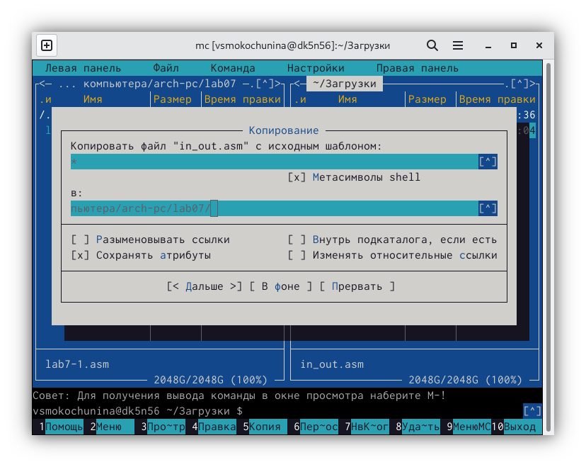
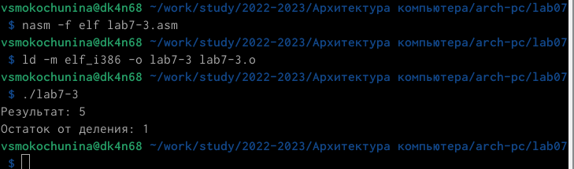

---
## Front matter
title: "Отчет по лабораторной работе №7 "
subtitle: " Арифметические операции в NASM"
author: "Мокочунина Влада Сергеевна"

## Generic otions
lang: ru-RU
toc-title: "Содержание"

## Bibliography
bibliography: bib/cite.bib
csl: pandoc/csl/gost-r-7-0-5-2008-numeric.csl

## Pdf output format
toc: true # Table of contents
toc-depth: 2
lof: true # List of figures
lot: true # List of tables
fontsize: 12pt
linestretch: 1.5
papersize: a4
documentclass: scrreprt
## I18n polyglossia
polyglossia-lang:
  name: russian
  options:
	- spelling=modern
	- babelshorthands=true
polyglossia-otherlangs:
  name: english
## I18n babel
babel-lang: russian
babel-otherlangs: english
## Fonts
mainfont: PT Serif
romanfont: PT Serif
sansfont: PT Sans
monofont: PT Mono
mainfontoptions: Ligatures=TeX
romanfontoptions: Ligatures=TeX
sansfontoptions: Ligatures=TeX,Scale=MatchLowercase
monofontoptions: Scale=MatchLowercase,Scale=0.9
## Biblatex
biblatex: true
biblio-style: "gost-numeric"
biblatexoptions:
  - parentracker=true
  - backend=biber
  - hyperref=auto
  - language=auto
  - autolang=other*
  - citestyle=gost-numeric
## Pandoc-crossref LaTeX customization
figureTitle: "Рис."
tableTitle: "Таблица"
listingTitle: "Листинг"
lofTitle: "Список иллюстраций"
lolTitle: "Листинги"
## Misc options
indent: true
header-includes:
  - \usepackage{indentfirst}
  - \usepackage{float} # keep figures where there are in the text
  - \floatplacement{figure}{H} # keep figures where there are in the text
---

# Цель работы
Освоение арифметических инструкций языка ассемблера NASM.
Освоение арифметических инструкций языка ассемблера NASM.

# Задание

Освоить арифметические инструкции языка ассемблера NASM.

# Выполнение лабораторной работы

1. Я создала каталог для программам лабораторной работы No 7, перешла в
него и создала файл lab7-1.asm (рис. [-@fig:001])

{ #fig:001 width=70% }

2. Я ввела в файл текст из листинга 1.

{ #fig:002 width=70% }

3. Я скопировала файл в каталог.

{ #fig:003 width=70% }

4. Я создала файл и запустила его.

{ #fig:004 width=70% }

5. Я заменила текст программы.

{ #fig:005 width=70% }

6. Я создала и запустила файл.

{ #fig:006 width=70% }

Код 10 соответствует пустому символу 

7. Я создала файл lab7-2.asm

{ #fig:007 width=70% }

8. Я ввела  в файл текст из листинга 2.

{ #fig:008 width=70% }

9. Я создала и запустила файл.

{ #fig:009 width=70% }

10. Я изменила текст программы.

{ #fig:010 width=70% }

11. Я создала и запустила файл.

{ #fig:011 width=70% }

12. Я заменила функцию iprintLF на iprint.

{ #fig:012 width=70% }

13. Я создала и запустила файл.
Освоение арифметических инструкций языка ассемблера NASM.
{ #fig:013 width=70% }

Вывод функций iprintLF и iprint отличается тем, что iprintLF выводит ее на следующую строчку, а iprint на ту же.

14. Я создала файл lab7-3.asm.

{ #fig:014 width=70% }

15. Я ввела в файл текст из листинга 3.

{ #fig:015 width=70% }

16. Я создала и запустила файл.

{ #fig:016 width=70% }

17. Я изменила текст для вычисления следующего выражения.

{ #fig:017 width=70% }

18. Я создала и запустила файл.

{ #fig:018 width=70% }

19. Я создала файл variant.asm.

{ #fig:019 width=70% }

20. Я ввела в файл текст из листинга 4.

{ #fig:020 width=70% }

21. Я создала и запустила файл. Мой вариант-3

{ #fig:021 width=70% }

# Ответы на вопросы

1. Какие строки листинга 7.4 отвечают за вывод на экран сообщения ‘Ваш
вариант:’?

mov eax,msg call sprintLF

2. Для чего используется следующие инструкции? nasm mov ecx, x
mov edx, 80 call sread

Для ввода неизвестной x и сохранения введенных данных

3. Для чего используется инструкция “call atoi”?

Для преобразования кода переменной ASCII в число

4. Какие строки листинга 7.4 отвечают за вычисления варианта?

mov ebx,20 div inc edx

5. В какой регистр записывается остаток от деления при выполнении ин-
струкции “div ebx”?

В регистре ebx

6. Для чего используется инструкция “inc edx”?

Для увеличения значения edx на на 1

7. Какие строки листинга 7.4 отвечают за вывод на экран результата вычис-
лений?

mov eax,edx call iprintLF

# Самостоятельная работа

1. Я создала файл lab7-4.asm и ввела в него собственную программу для вычисления функции

{ #fig:022 width=70% }

2. Я создала и запустила файл.

{ #fig:023 width=70% }

# Выводы

Я освоила арифметические инструкции языка ассемблера NASM.

# Список литературы{.unnumbered}

::: {#refs}
:::
