---
## Front matter
title: "Отчёт по лабораторной работе №9"
subtitle: "Программирование цикла. Обработка аргументов командной строки."
author: "Мокочунина Влада Сергеевна"

## Generic otions
lang: ru-RU
toc-title: "Содержание"

## Bibliography
bibliography: bib/cite.bib
csl: pandoc/csl/gost-r-7-0-5-2008-numeric.csl

## Pdf output format
toc: true # Table of contents
toc-depth: 2
lof: true # List of figures
lot: true # List of tables
fontsize: 12pt
linestretch: 1.5
papersize: a4
documentclass: scrreprt
## I18n polyglossia
polyglossia-lang:
  name: russian
  options:
	- spelling=modern
	- babelshorthands=true
polyglossia-otherlangs:
  name: english
## I18n babel
babel-lang: russian
babel-otherlangs: english
## Fonts
mainfont: PT Serif
romanfont: PT Serif
sansfont: PT Sans
monofont: PT Mono
mainfontoptions: Ligatures=TeX
romanfontoptions: Ligatures=TeX
sansfontoptions: Ligatures=TeX,Scale=MatchLowercase
monofontoptions: Scale=MatchLowercase,Scale=0.9
## Biblatex
biblatex: true
biblio-style: "gost-numeric"
biblatexoptions:
  - parentracker=true
  - backend=biber
  - hyperref=auto
  - language=auto
  - autolang=other*
  - citestyle=gost-numeric
## Pandoc-crossref LaTeX customization
figureTitle: "Рис."
tableTitle: "Таблица"
listingTitle: "Листинг"
lofTitle: "Список иллюстраций"
## Misc options
indent: true
header-includes:
  - \usepackage{indentfirst}
  - \usepackage{float} # keep figures where there are in the text
  - \floatplacement{figure}{H} # keep figures where there are in the text
---

# Цель работы

Приобретение навыков написания программ с использованием циклов и
обработкой аргументов командной строки.

# Задание

Приобрести навыки написания программ с использованием циклов и обработки аргументов командной строки.

# Выполнение лабораторной работы

1.Я создала каталог для программам лабораторной работы No 9, перешла  в
него и создала файл lab9-1.asm (рис. [-@fig:001])

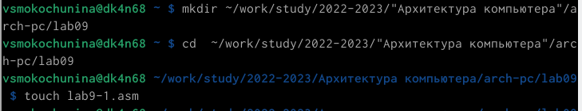{ #fig:001 width=70% }

2. Я ввела в файл текст из листинга 1

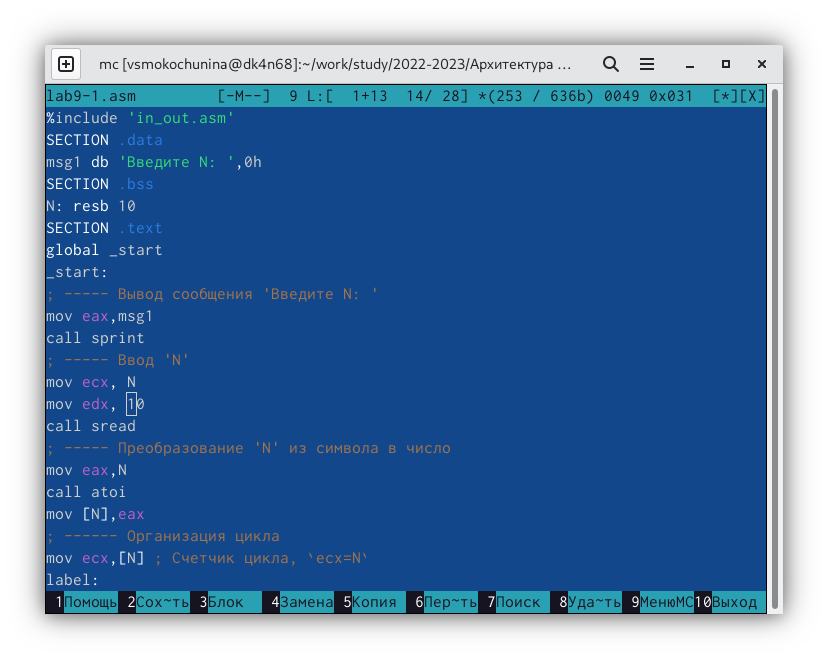{ #fig:002 width=70% }

3. Я создала и запустила файл

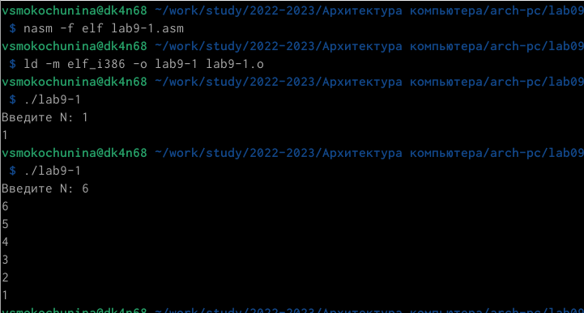{ #fig:003 width=70% }

4. Я изменила текст программы

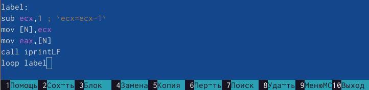{ #fig:004 width=70% }

5. Я создала и запустила файл

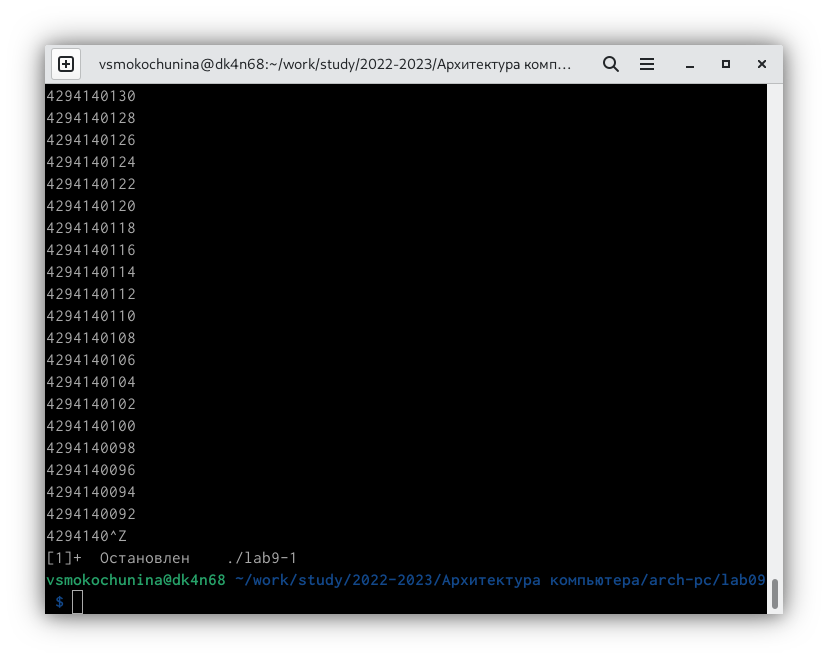{ #fig:005 width=70% }

6. Я изменила текст программы

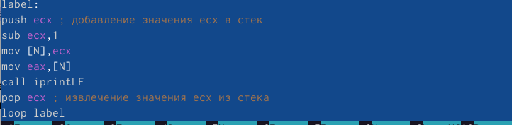{ #fig:006 width=70% }

7. Я создала и запустила файл

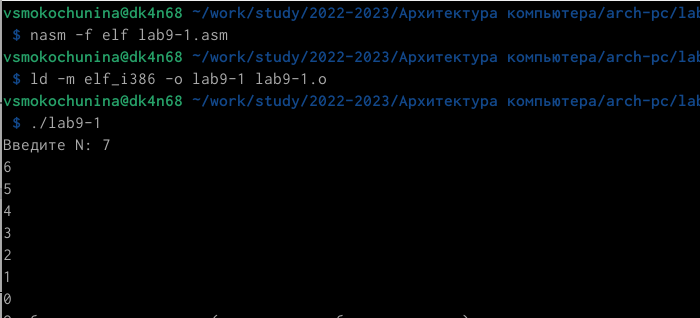{ #fig:007 width=70% }

8. Я создала файл lab9-2.asm и ввела в него текст из листинга 2

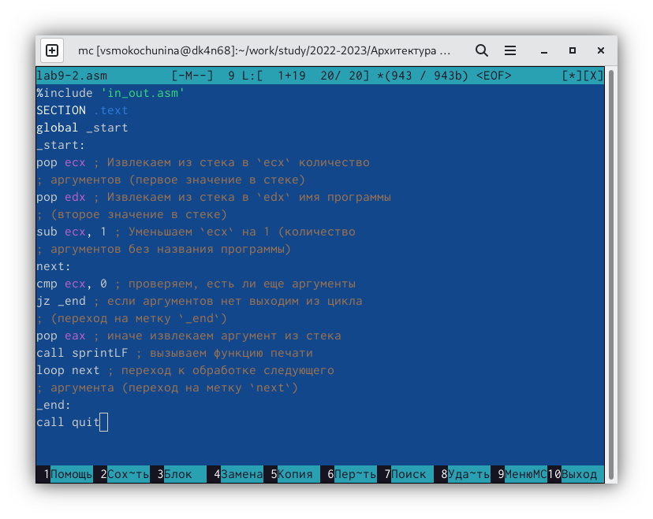{ #fig:008 width=70% }

9. Я создала файл и запустила,указав аргументы

{ #fig:009 width=70% }

Все три аргумента были обработаны

10. Я создала файл lab9-3.asm и ввела в него текст из листинга 3

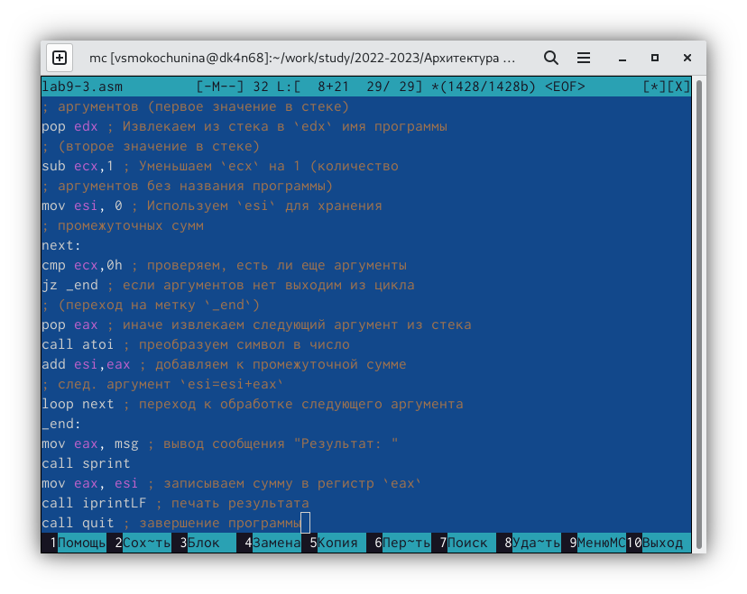{ #fig:010 width=70% }

11. Я создала и запустила файл

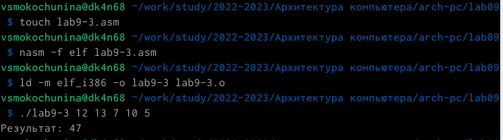{ #fig:011 width=70% }

12. Я изменила текст программы для вычисления произведения аргументов командной строки

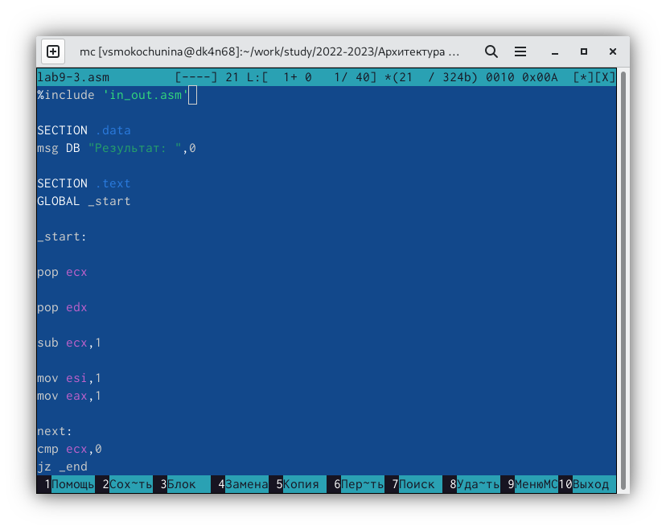{ #fig:012 width=70% }

13. Я создала и запустила файл

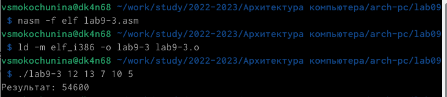{ #fig:013 width=70% }

# Самостоятельная работа

1. Я написала программу, находящую сумму значений функции

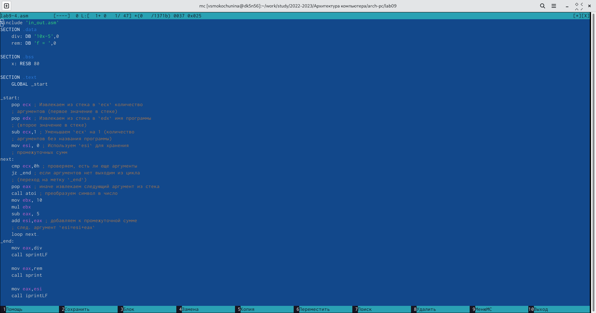{ #fig:014 width=70% }

2. Я создала и запустила файл

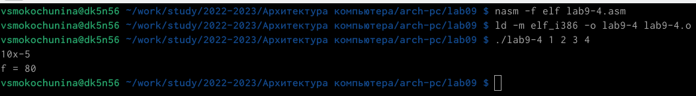{ #fig:015 width=70% }

# Выводы

Я приобрела навыки написания программ с использованием циклов и обработки аргументов командной строки.

# Список литературы{.unnumbered}

::: {#refs}
:::
