---
## Front matter
title: "Отчет по лабораторной работе №10"
subtitle: "Понятие подпрограммы. Откладчик GDB"
author: "Мокочунина Влада Сергеевна"

## Generic otions
lang: ru-RU
toc-title: "Содержание"

## Bibliography
bibliography: bib/cite.bib
csl: pandoc/csl/gost-r-7-0-5-2008-numeric.csl

## Pdf output format
toc: true # Table of contents
toc-depth: 2
lof: true # List of figures
lot: true # List of tables
fontsize: 12pt
linestretch: 1.5
papersize: a4
documentclass: scrreprt
## I18n polyglossia
polyglossia-lang:
  name: russian
  options:
	- spelling=modern
	- babelshorthands=true
polyglossia-otherlangs:
  name: english
## I18n babel
babel-lang: russian
babel-otherlangs: english
## Fonts
mainfont: PT Serif
romanfont: PT Serif
sansfont: PT Sans
monofont: PT Mono
mainfontoptions: Ligatures=TeX
romanfontoptions: Ligatures=TeX
sansfontoptions: Ligatures=TeX,Scale=MatchLowercase
monofontoptions: Scale=MatchLowercase,Scale=0.9
## Biblatex
biblatex: true
biblio-style: "gost-numeric"
biblatexoptions:
  - parentracker=true
  - backend=biber
  - hyperref=auto
  - language=auto
  - autolang=other*
  - citestyle=gost-numeric
## Pandoc-crossref LaTeX customization
figureTitle: "Рис."
tableTitle: "Таблица"
listingTitle: "Листинг"
lofTitle: "Список иллюстраций"
## Misc options
indent: true
header-includes:
  - \usepackage{indentfirst}
  - \usepackage{float} # keep figures where there are in the text
  - \floatplacement{figure}{H} # keep figures where there are in the text
---

# Цель работы

Приобретение навыков написания программ с использованием подпрограмм. Знакомство с методами отладки при помощи GDB и его основными возможностями.

# Задание

Приобрести навыки написания программ с использованием подпрограмм, познакомиться с методами отладки при помощи GDB и его основными возможностями.

# Выполнение лабораторной работы

1. Я создала каталог для лабораторной работы №10 и создала файл lab10-1.asm (рис. [-@fig:001])

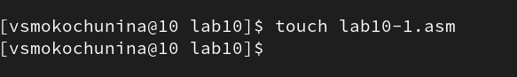{ #fig:001 width=70% }

2. Я ввела в него текст из листинга 1

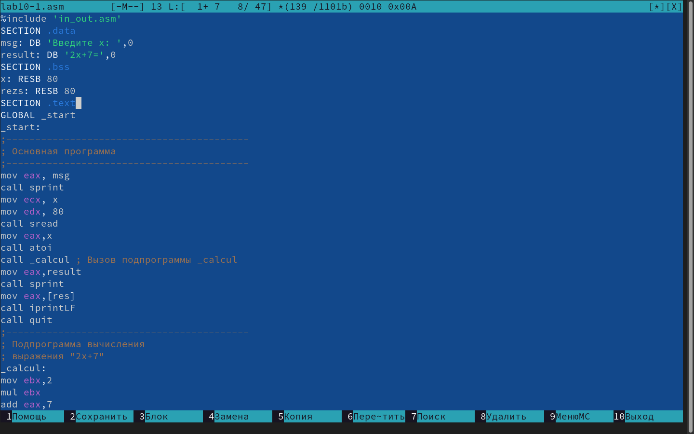{ #fig:002 width=70% }

3. Я создала файл и проверила его работу

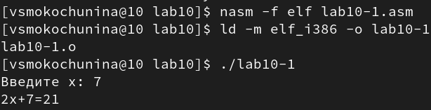{ #fig:003 width=70% }

4. Я изменила текст программы для вычисления заданного выражения

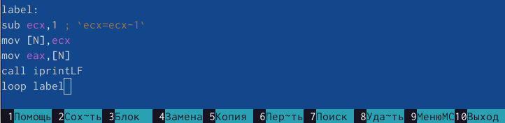{ #fig:004 width=70% }

5. Я создала и запустила файл

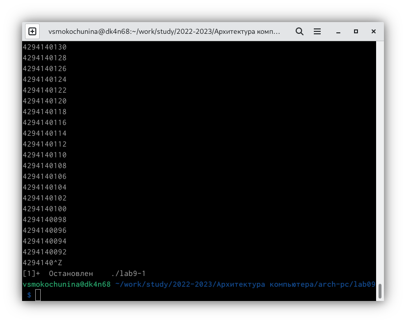{ #fig:005 width=70% }

6. Я создала файл lab10-2.asm и ввела в него текст из листинга 2

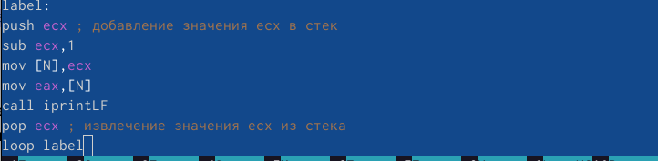{ #fig:006 width=70% }

7. Я получила исполняемый файл, загрузила его в откладчик gdb и проверила работу программы, запустив ее в оболочке GDB

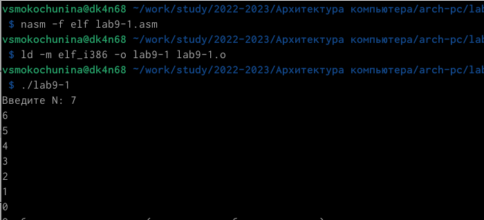{ #fig:007 width=70% }

8. Я установила брейкпоинт на метку _start

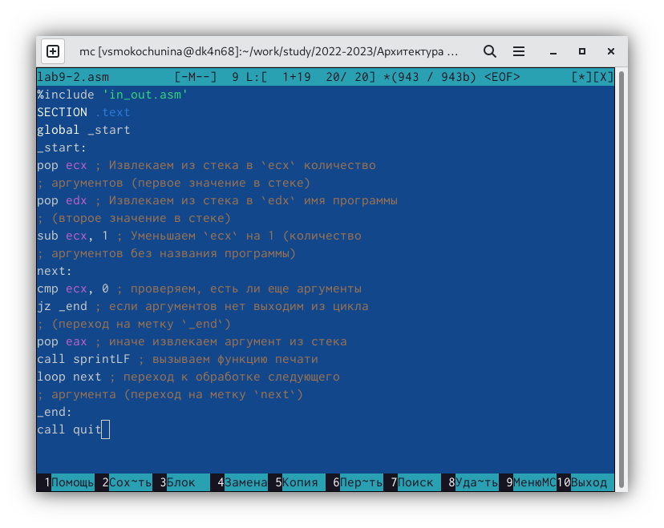{ #fig:008 width=70% }

9. Я посмотрела дисассимилированный код программы

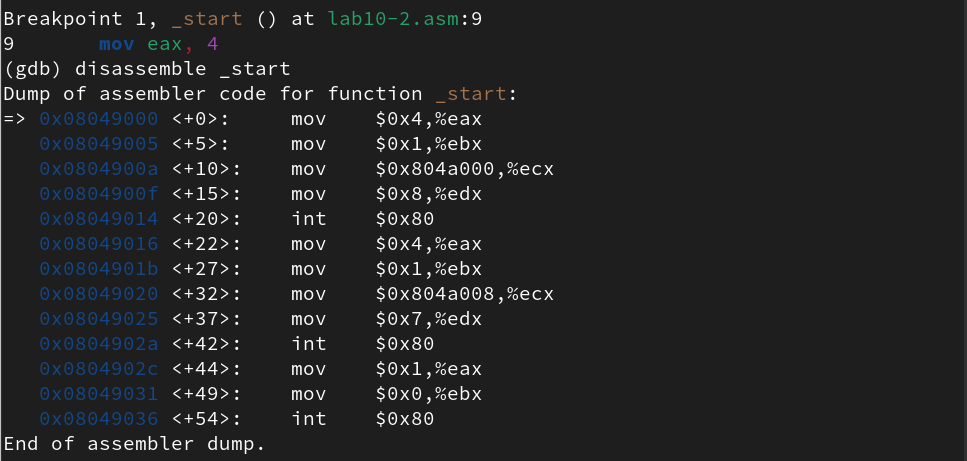{ #fig:009 width=70% }

10. Я переключилась на отображение команд с Intel’овским синтаксисом

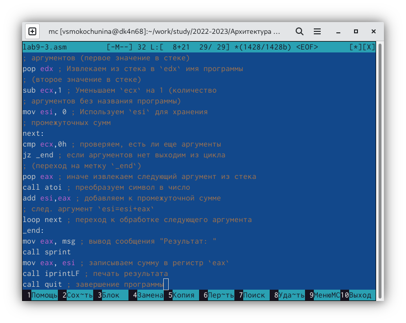{ #fig:010 width=70% }

Различие только в отсутствии символов % и $

11. Я включила режим псевдографики

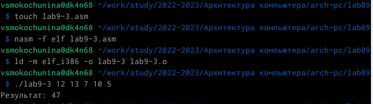{ #fig:011 width=70% }

12. Я проверила точку останова и установила свою

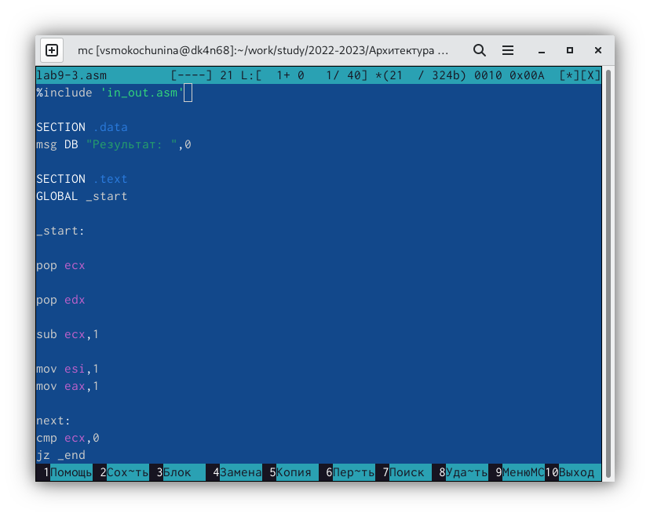{ #fig:012 width=70% }

13. Я посмотрела регистры

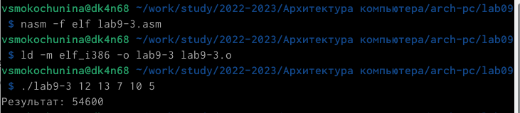{ #fig:013 width=70% }

14. Я посмотрела значение переменной msg1

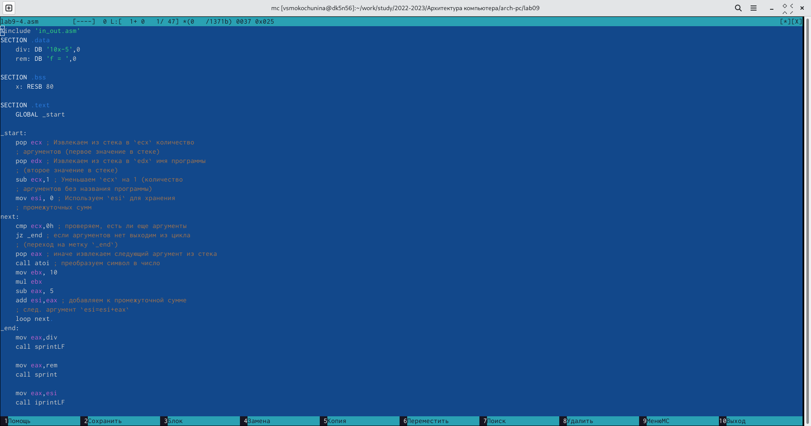{ #fig:014 width=70% }

15. Я посмотрела значение переменной msg2

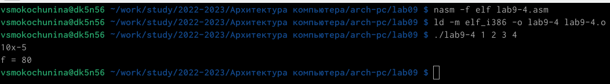{ #fig:015 width=70% }

16. Я изменила первый символ переменной msg1

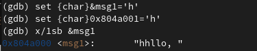{ #fig:016 width=70% }

17. Я заменила символ переменной msg2

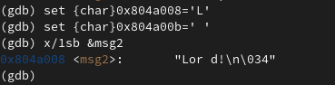{ #fig:017 width=70% }

18. Я вывела значения регистров

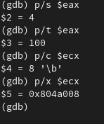{ #fig:018 width=70% }

19. Я изменила значение регистра ebx

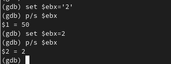{ #fig:019 width=70% }

Выводится два разных значения, так как в первом случае мы вносим двойку, а во втором сам регистр равен двум

20. Я завершила выполнение программы и вышла

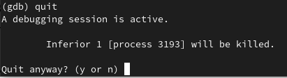{ #fig:020 width=70% }

21. Я скопировала файл из лабораторной №9 в лабораторную №10

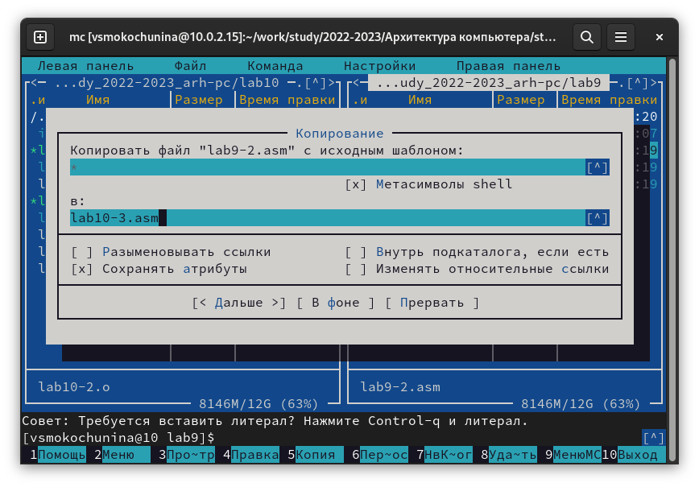{ #fig:021 width=70% }

22. Я создала файл и загрузила,указав аргументы

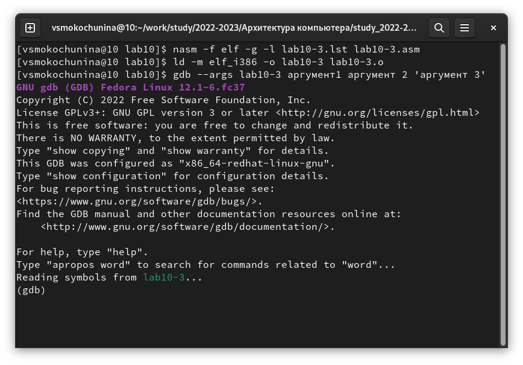{ #fig:022 width=70% }

23. Я установила точку останова

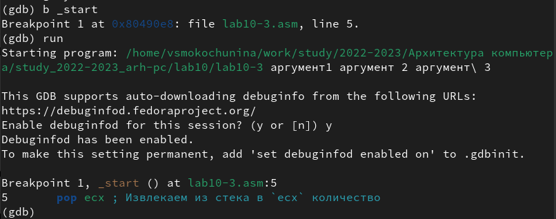{ #fig:023 width=70% }

24. Я посмотрела адрес вершины стека

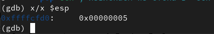{ #fig:024 width=70% }

25. Я посмотрела остальные позиции стека

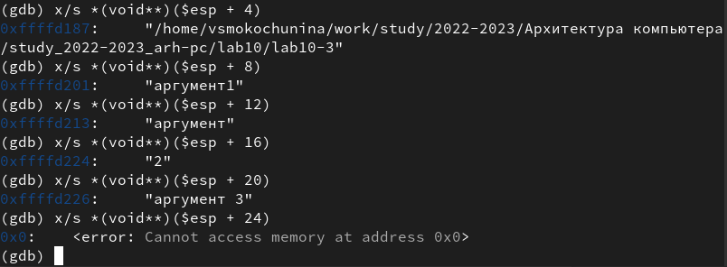{ #fig:025 width=70% }

Интервал между элементами 4, так как в стеке хранится только до 4 байт

# Самостоятельная работа

1. Я преобразовала программу из лабораторной работы No9, реализовав вычисление значения функции 𝑓(𝑥) как подпрограмму.

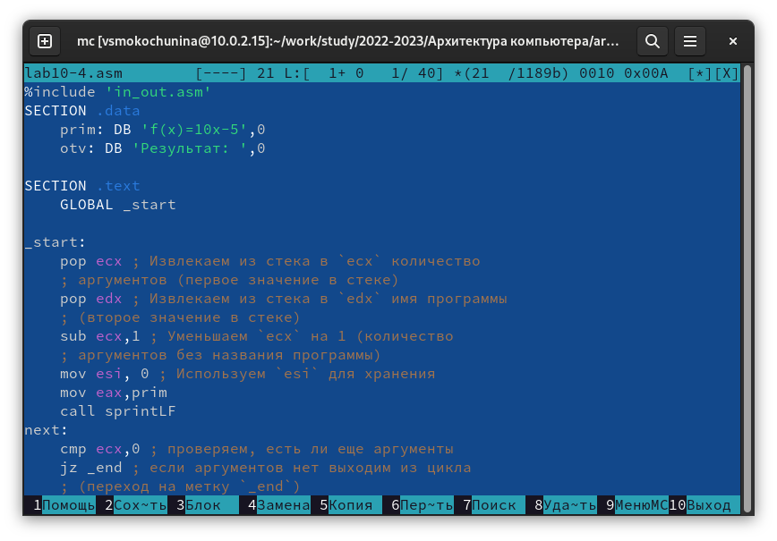{ #fig:026 width=70% }

2. Я создала и запустила файл

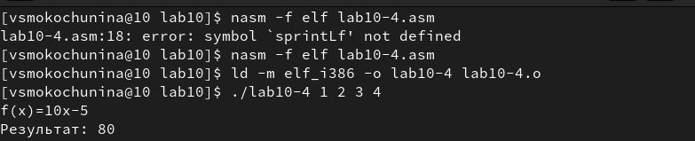{ #fig:027 width=70% }

3. Я создала файл и ввела из него программу из листинга 3

{ #fig:028 width=70% }

4. Я запустила файл и увидела.что выдает ошибку

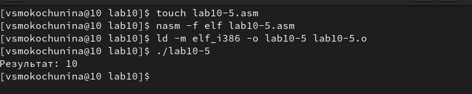{ #fig:029 width=70% }

5. Я запустила файл с помощью откладчика gdb

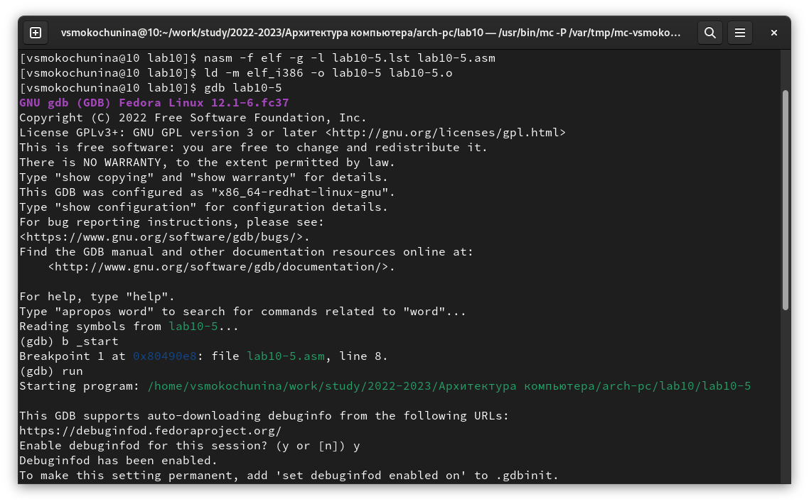{ #fig:030 width=70% }

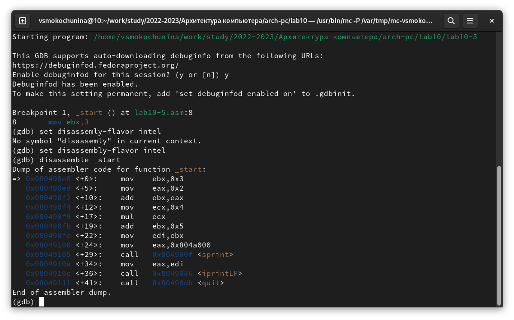{ #fig:031 width=70% }

6. Я посмотрела,что регистры стоят не на своих местах и изменила это

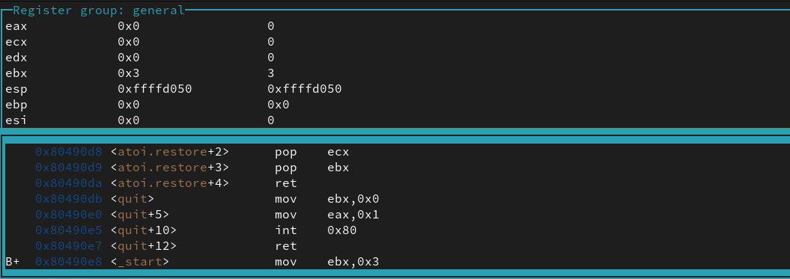{ #fig:032 width=70% }

7. Я проверила работу программы

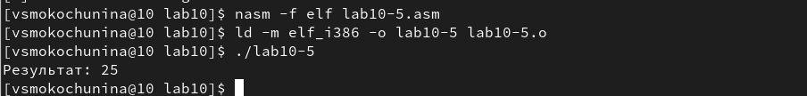{ #fig:033 width=70% }

#Вывод

Я приобрела навыки написания программ с использованием подпрограмм, познакомилась с методами отладки при помощи GDB и его основными возможностями.

::: {#refs}
:::
