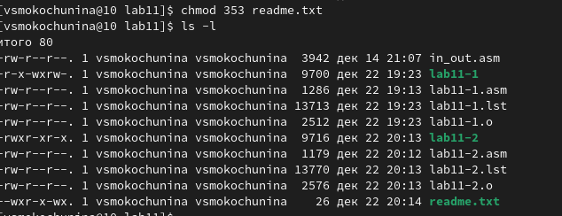

---
## Front matter
title: "Отчёт по лабораторной работе №11"
subtitle: "Работа с файлами средствами Nasm"
author: "Мокочунина Влада Сергеевна"

## Generic otions
lang: ru-RU
toc-title: "Содержание"

## Bibliography
bibliography: bib/cite.bib
csl: pandoc/csl/gost-r-7-0-5-2008-numeric.csl

## Pdf output format
toc: true # Table of contents
toc-depth: 2
lof: true # List of figures
lot: true # List of tables
fontsize: 12pt
linestretch: 1.5
papersize: a4
documentclass: scrreprt
## I18n polyglossia
polyglossia-lang:
  name: russian
  options:
	- spelling=modern
	- babelshorthands=true
polyglossia-otherlangs:
  name: english
## I18n babel
babel-lang: russian
babel-otherlangs: english
## Fonts
mainfont: PT Serif
romanfont: PT Serif
sansfont: PT Sans
monofont: PT Mono
mainfontoptions: Ligatures=TeX
romanfontoptions: Ligatures=TeX
sansfontoptions: Ligatures=TeX,Scale=MatchLowercase
monofontoptions: Scale=MatchLowercase,Scale=0.9
## Biblatex
biblatex: true
biblio-style: "gost-numeric"
biblatexoptions:
  - parentracker=true
  - backend=biber
  - hyperref=auto
  - language=auto
  - autolang=other*
  - citestyle=gost-numeric
## Pandoc-crossref LaTeX customization
figureTitle: "Рис."
tableTitle: "Таблица"
listingTitle: "Листинг"
lofTitle: "Список иллюстраций"
## Misc options
indent: true
header-includes:
  - \usepackage{indentfirst}
  - \usepackage{float} # keep figures where there are in the text
  - \floatplacement{figure}{H} # keep figures where there are in the text
---

# Цель работы

Приобретение навыков написания программ для работы с файлами.

# Задание

Приобрести навыки написания программ для работы с файлами.

# Выполнение лабораторной работы

1. Я создала каталог для программам лабораторной работы No 11, перешла
в него и создала файл lab11-1.asm и readme.txt (рис. [-@fig:001])

{ #fig:001 width=70% }

2. Я ввела в файл lab11-1.asm текст программы из листинга 11.1, создала исполняемый файл и проверьте его работу

{ #fig:002 width=70% }

{ #fig:003 width=70% }

3. С помощью команды chmod я изменила права доступа к исполняемому файлу lab11-1, запретив его выполнение,попыталась выполнить файл.

{ #fig:004 width=70% }

Выдает отказ в доступе, так как я ограничила права для всех пользователей к исполнению

4. С помощью команды chmod я изменила права доступа к файлу lab11-1.asm с
исходным текстом программы, добавив права на исполнение,попыталась выполнить его

{ #fig:005 width=70% }

Файл с исходным текстом был со всеми разрешениями,и я запретила выполнение программы, а так как это новая программа,обладающая другими разрешениями,он запустился

5. Я предоставила права доступа к файлу readme.txt в соответствии с вариантом 3

{ #fig:006 width=70% }

{ #fig:007 width=70% }

#Самостоятельная работа

1. Я написала программу работающую по следующему алгоритму

{ #fig:008 width=70% }

{ #fig:009 width=70% }

# Выводы

Я приобрела навыки написания программ для работы с файлами.

# Список литературы{.unnumbered}

::: {#refs}
:::
